# Haven App

A modern, dark-themed wallpaper application powered by the [Wallhaven API](https://wallhaven.cc/), built with Flutter.

[](https://flutter.dev)
[](https://dart.dev)
[](#screenshots-)
[](LICENSE)

---

## Features ✨

### 🔍 Discovery & Search
- **Quick Filters:** Switch between **Toplist**, **Hot**, **Latest**, and **Random** wallpapers with a single tap.
- **Category Selection:** Toggle **General**, **Anime**, and **People** categories independently.
- **Purity Filtering:** Filter wallpapers by **SFW**, **Sketchy**, and **NSFW** (unlocked via authenticated API key).
- **Interactive Tag Search:** Tap any tag in wallpaper details to immediately launch a search for related wallpapers.
- **Palette Previews:** Dominant color swatches displayed directly on wallpaper cards.
- **Visual Purity Indicators:** Distinctive borders for Sketchy (orange) and NSFW (red) wallpapers.

### 📄 Fast Pagination
- **Page Controls:** Move forwards or backwards through search results.
- **Direct Page Jumper:** Tap the page indicator to open a picker wheel dialog and jump directly to any page.

### 🖼️ Immersive Wallpaper Viewer
- **Interactive Zoom:** Pan and pinch-to-zoom up to 5x with `InteractiveViewer`.
- **Aspect Ratio Modes:** Toggle between **Cover** and **Contain** modes.
- **Distraction-Free UI:** Tap anywhere to toggle controls on/off.
- **Comprehensive Metadata:** View uploader name and avatar, native resolution, file size, categories, and tags.

### 💾 Local Gallery & Offline Storage
- **Download Wallpapers:** Download original high-resolution wallpapers with real-time download progress.
- **OS-Aware Storage:** Automatically routes downloads to standard user Pictures folders across Android, macOS, Windows, and Linux via `WallpaperStorage`.
- **Saved Wallpapers Tab:** Browse previously downloaded wallpapers in a dedicated local gallery.

### 📤 Sharing
- **Flexible Sharing:** Share wallpapers either as direct image files or web links through native share dialogs.

### ⚙️ API Key & Personalization
- **Wallhaven API Integration:** Enter your personal Wallhaven API key to unlock user preferences and NSFW content.
- **Key Privacy & Tools:** Obscure/reveal toggle, clipboard paste, and quick-clear actions for API keys.
- **State Persistence:** Settings and queries are persisted across app restarts using `HydratedBloc`.

---

## Architecture & Project Structure 🧱

Haven follows a feature-first architecture layered with the BLoC pattern:

```
lib/
├── bootstrap.dart              # App initialization, HydratedBloc storage setup, global error handling
├── haven_app.dart              # Repository and MultiBlocProvider dependency injection
├── main.dart                   # Application entry point
├── core/
│   ├── models/                 # Shared domain data models
│   ├── utils/                  # AppTheme, AppLogger, color utilities
│   └── widgets/                # Search bar, category filters, dialogs, buttons
├── data/
│   ├── api/                    # WallhavenApiClient & LoggingClient (HTTP telemetry)
│   ├── models/                 # Serialization models (Wallpaper, Uploader, Tag, Thumbs, Meta)
│   └── repository/             # WallhavenRepository & WallpaperStorage
└── features/
    ├── navigation/             # NavigationBarPage with IndexedStack state preservation
    ├── wallpaper_search/       # HomePage, WallpaperListPage, SearchCubit & SearchState
    ├── wallpaper_details/      # WallpaperDetailsPage, DetailsCubit & DetailsState
    ├── wallpaper_actions/      # Download and share action streams (ActionsCubit)
    ├── saved_wallpapers/       # SavePage, DownloadedWallpaperPage, SavedWallpapersCubit
    └── settings/               # SettingsPage, SettingsCubit & SettingsState
```

---

## Built With 🛠️

- **[Flutter](https://flutter.dev)** - Cross-platform UI toolkit with Material 3 styling
- **[Bloc & Hydrated Bloc](https://pub.dev/packages/flutter_bloc)** - Predictable state management with local persistence
- **[Wallhaven API](https://wallhaven.cc/help/api)** - REST API for high-resolution wallpapers
- **[Cached Network Image](https://pub.dev/packages/cached_network_image)** - Network image caching and placeholder rendering
- **[Share Plus](https://pub.dev/packages/share_plus)** - Native cross-platform content sharing
- **[Path Provider](https://pub.dev/packages/path_provider)** & **[Permission Handler](https://pub.dev/packages/permission_handler)** - Filesystem access and permission workflows
- **[Logging](https://pub.dev/packages/logging)** - Structured logging with custom HTTP interceptors
- **[MSIX](https://pub.dev/packages/msix)** - Modern packaging for Windows distribution

---

## Getting Started 🚀

### Prerequisites
- [Flutter SDK](https://docs.flutter.dev/get-started/install) (`^3.13.4` or later)
- Dart SDK (`^3.0.0` or later)
- A device, emulator, or desktop build environment (Windows C++ tools, Xcode for macOS/iOS, or Linux GTK dependencies)

### Installation

1. **Clone the repository:**
   ```bash
   git clone https://github.com/thiago-odawara/haven_app.git
   cd haven_app
   ```

2. **Install dependencies:**
   ```bash
   flutter pub get
   ```

3. **Run the app:**
   Launch on a connected device or desktop target:
   ```bash
   # Automatically choose a connected target:
   flutter run

   # Or specify a target platform:
   flutter run -d windows    # Windows Desktop
   flutter run -d android    # Android (device or emulator)
   flutter run -d macos      # macOS (macOS host)
   flutter run -d linux      # Linux (Linux host)
   flutter run -d ios        # iOS (macOS host)
   ```

4. **Run unit tests:**
   ```bash
   flutter test
   ```

---

## Platform Build Instructions 📦

### 🤖 Android
- **Requirements:** Android SDK (API 34+) and Java JDK 17.
- **Build APK (Release):**
  ```bash
  flutter build apk --release
  # Output: build/app/outputs/flutter-apk/app-release.apk
  ```
- **Build Split APKs (reduced size per architecture):**
  ```bash
  flutter build apk --split-per-abi
  ```
- **Build App Bundle (for Google Play Store):**
  ```bash
  flutter build appbundle --release
  # Output: build/app/outputs/bundle/release/app-release.aab
  ```

### 🪟 Windows
- **Requirements:** Windows 10/11 and Visual Studio (2022+) with the "Desktop development with C++" workload installed.
- **Build Executable (Release):**
  ```bash
  flutter build windows --release
  # Output: build/windows/x64/runner/Release/haven.exe
  ```
- **Build MSIX Installer Package:**
  ```bash
  flutter build windows --release
  dart run msix:create
  # Output: build/windows/x64/runner/Release/haven.msix
  ```

### 🐧 Linux
- **Requirements:** Linux environment with build utilities and GTK3 libraries:
  ```bash
  sudo apt-get update && sudo apt-get install -y clang cmake ninja-build pkg-config libgtk-3-dev
  ```
- **Build Release:**
  ```bash
  flutter build linux --release
  # Output: build/linux/x64/release/bundle/
  ```

### 🍎 macOS
- **Requirements:** macOS with [Xcode](https://developer.apple.com/xcode/) and CocoaPods installed.
- **Build Release:**
  ```bash
  flutter build macos --release
  # Output: build/macos/Build/Products/Release/haven.app
  ```

### 📱 iOS
- **Requirements:** macOS with Xcode, CocoaPods, and an active Apple Developer account for signing.
- **Build Unsigned / Archive (Release):**
  ```bash
  flutter build ios --release --no-codesign
  ```
- **Build IPA (for App Store / TestFlight distribution):**
  ```bash
  flutter build ipa --export-options-plist=ios/ExportOptions.plist
  # Output: build/ios/ipa/*.ipa
  ```

---

## Screenshots 📸

### Android

|                        Home Page                        |                        Save Page                        |                        Profile Page                        |
| ------------------------------------------------------- | ------------------------------------------------------- | ---------------------------------------------------------- |
|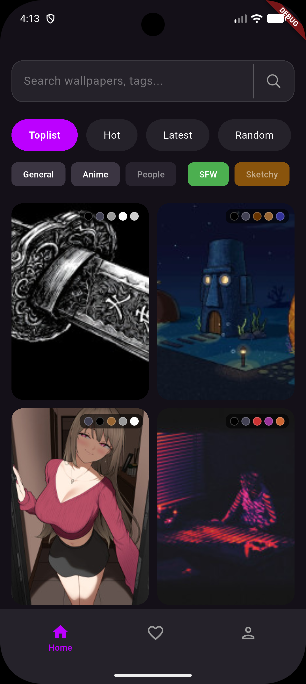|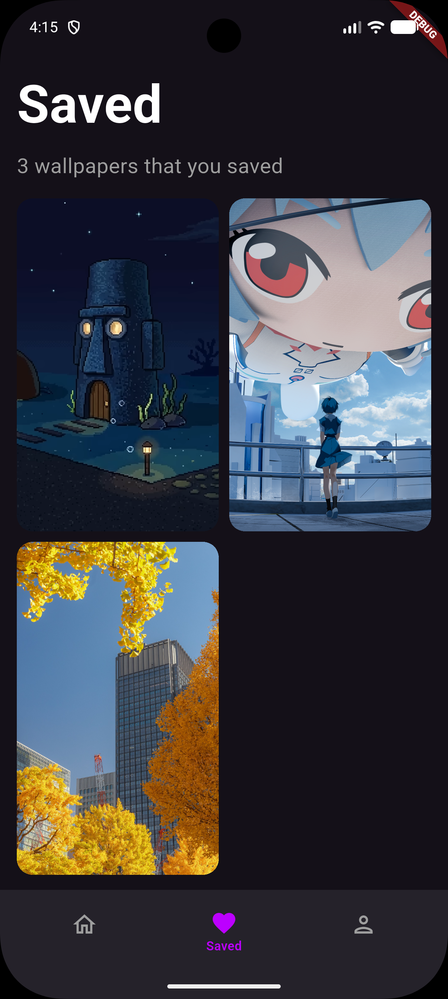|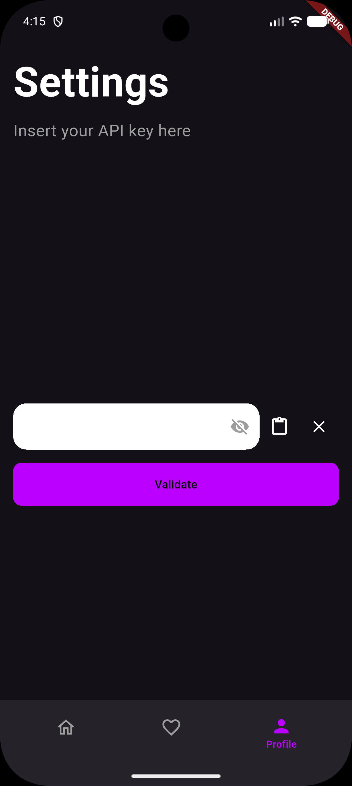|

### iOS

|                       Home Page                       |                       Save Page                       |                       Profile Page                       |
| ----------------------------------------------------- | ----------------------------------------------------- | -------------------------------------------------------- |
|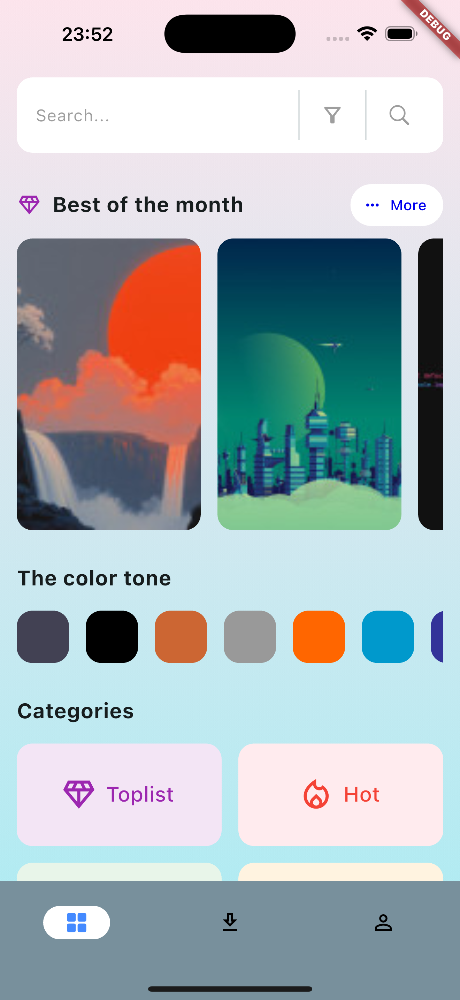|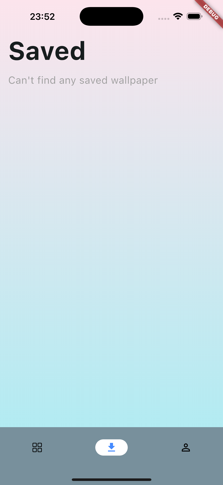|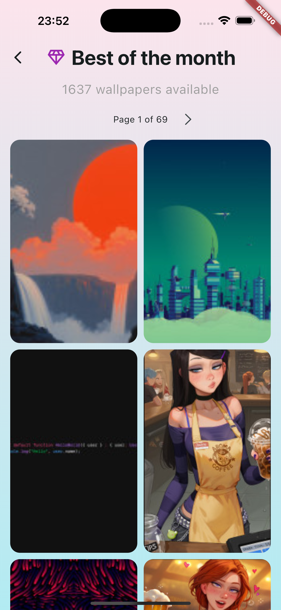|

### macOS

|                        Home Page                        |                        Save Page                        |                        Profile Page                        |
| ------------------------------------------------------- | ------------------------------------------------------- | ---------------------------------------------------------- |
|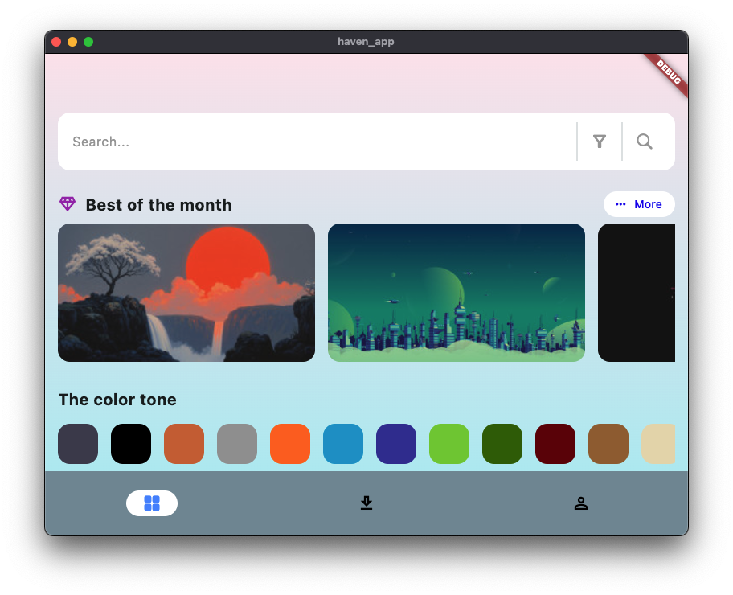|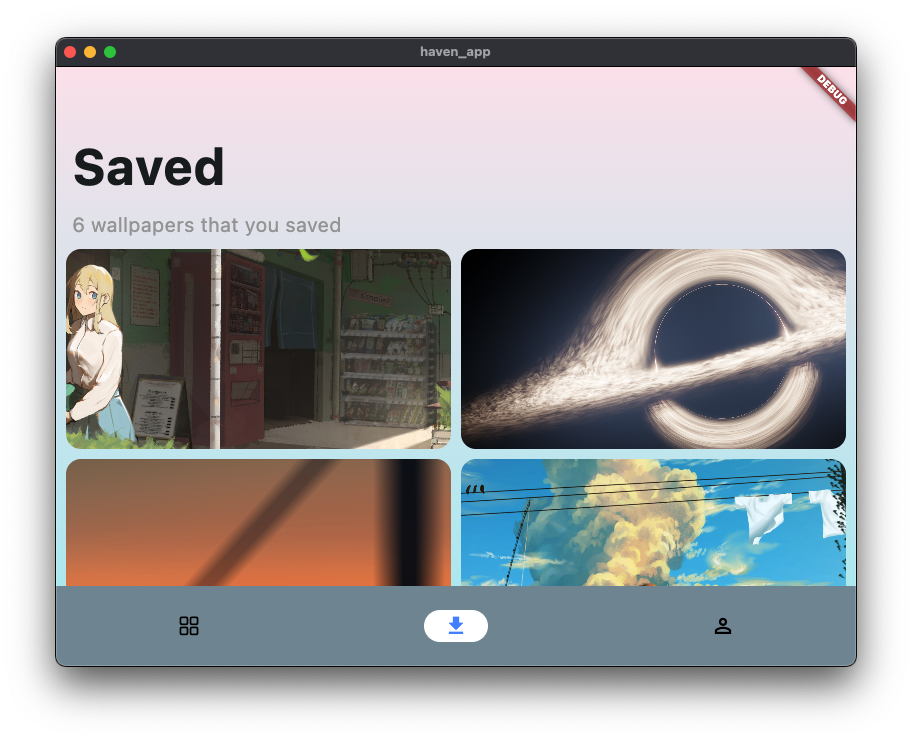|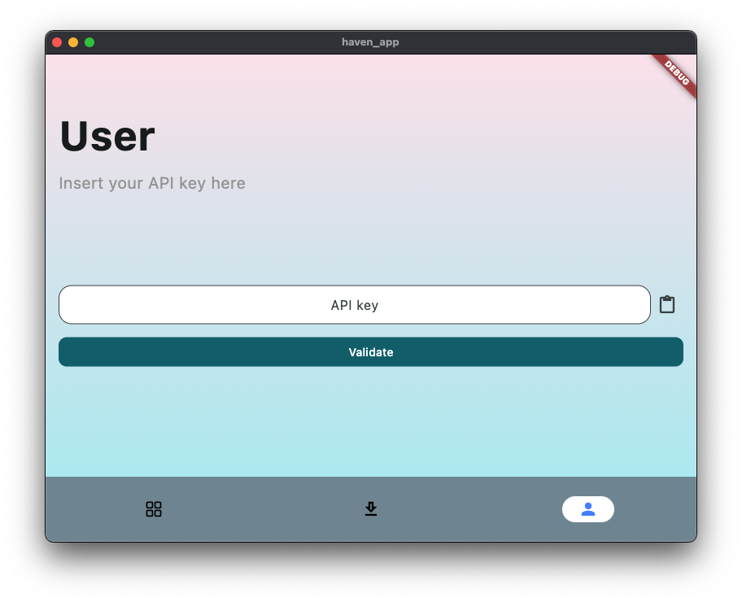|

### Linux

|                        Home Page                        |                        Save Page                        |
| ------------------------------------------------------- | ------------------------------------------------------- |
|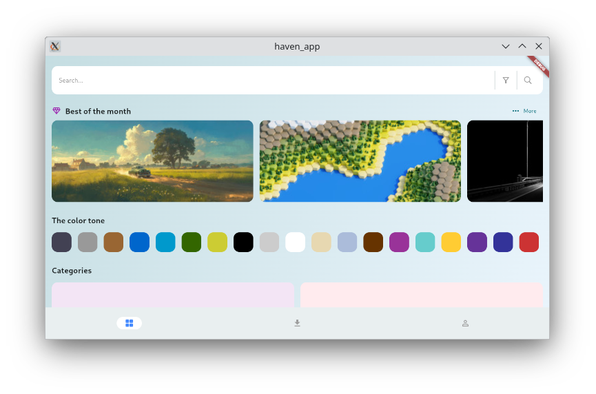|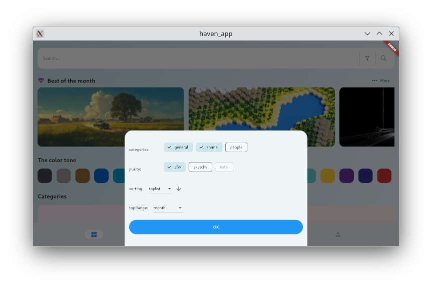|

### Windows

|                         Home Page                         |                         Save Page                         |                         Profile Page                         |
| --------------------------------------------------------- | --------------------------------------------------------- | ------------------------------------------------------------ |
|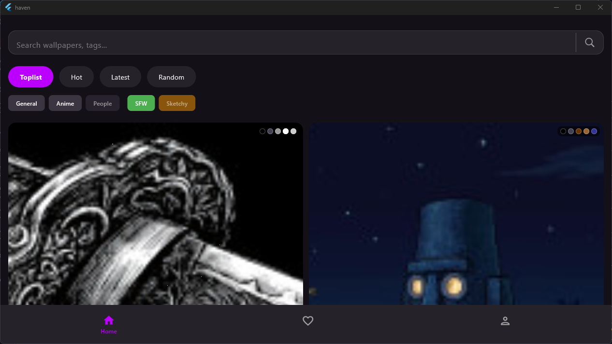|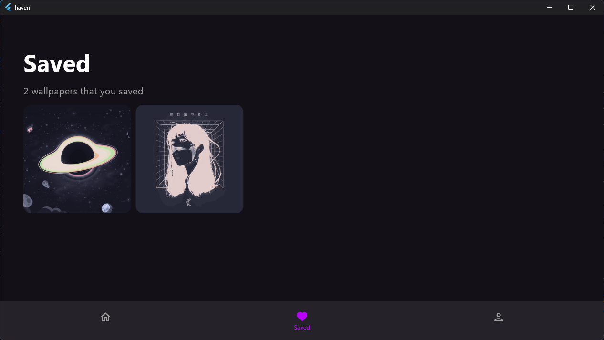|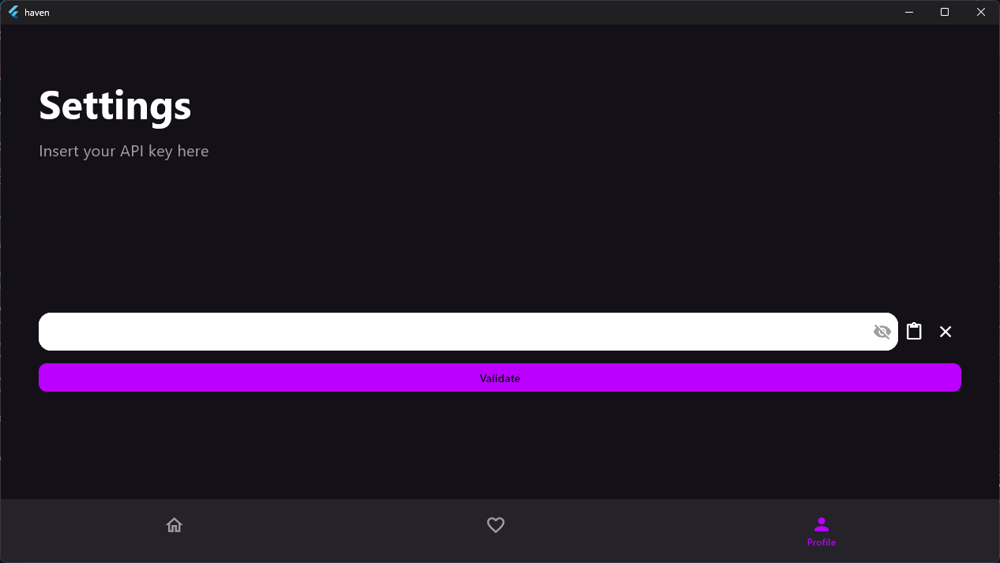|

_\*Haven App supports Android, iOS, macOS, Linux, and Windows._

---

## References & Design Inspiration 🎨

- [Wallhaven FAQ](https://wallhaven.cc/faq)
- [Wallhaven API v1 Documentation](https://wallhaven.cc/help/api)
- [Dribbble - Wallpaper app by Ibnu SW for SLAB Design Studio](https://dribbble.com/shots/14808564-Wallpaper-app)
- [Dribbble - Wallpaper app by Siya Beniwal](https://dribbble.com/shots/22910313-Wallpaper-app)

---

## License 📄

This project is licensed under the MIT License - see the [LICENSE](LICENSE) file for details.
